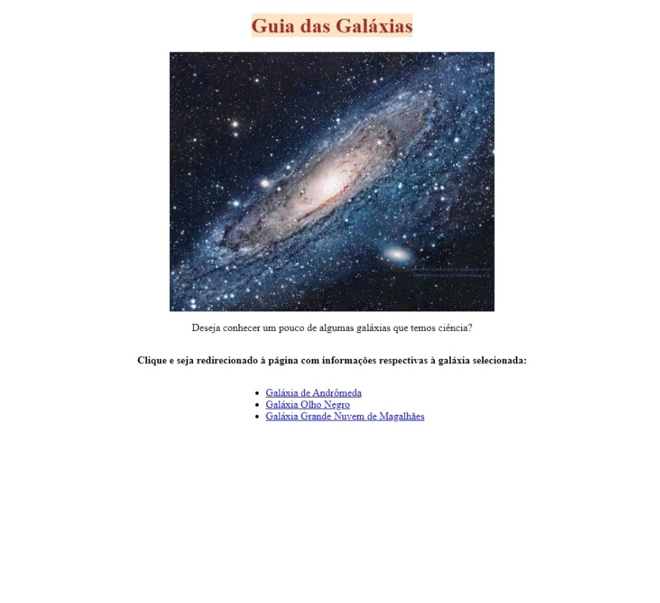

# Guia das Galáxias

> FullStack com a One Bit Code
> Projeto resultante de um desafio onde tinhamos que formartar textos simples, com elementos HTML, somente. Linkando as páginas entre si, utilizando também as listas e algumas outras tags.

[Clique aqui para acessar](https://codepen.io/Romanoff-97/pen/gOKYJRz/)

## Tecnologias 🛠

- HTML
- CSS - (somente na página inicial, que realizei à parte do desafio proposto. Poucos elementos.)

## Contato 📧

nscidreira@hotmail.com
<https://www.linkedin.com/in/nathalya-cidreira/>
